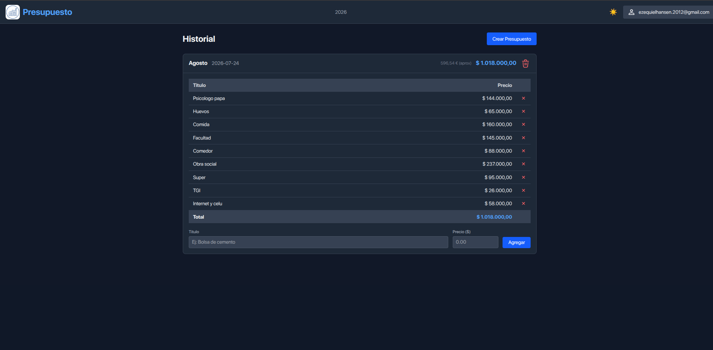

# 📊 Presupuesto

Aplicación web para llevar el control de un presupuesto mensual/anual, con una experiencia similar a una hoja de cálculo de Excel. Permite cargar ítems con título y precio, ver el total calculado automáticamente y consultar el historial de presupuestos por mes.

<!-- 📸 Espacio para captura general de la aplicación -->


## ✨ Características

- **Historial de presupuestos**: visualización organizada por mes y año (ej. Agosto 2026-07-24), con el total destacado.
- **Carga de ítems**: agregá conceptos con su título y precio (ej. Comida, Facultad, Internet y celu, etc.).
- **Cálculo automático del total** en base a todos los ítems cargados.
- **Eliminación de ítems** individuales mediante el ícono de papelera.
- **Conversión aproximada a otra moneda** (referencia en la esquina superior de cada presupuesto).
- **Modo claro/oscuro** (ícono de sol en el header).
- **Autenticación de usuarios**: cada usuario tiene su propio presupuesto privado.


## 👤 Roles de usuario

| Rol | Permisos |
|---|---|
| **Usuario logueado** | Puede crear presupuestos, agregar ítems, eliminar ítems y visualizar su propio historial. |
| **Visitante (sin sesión)** | Solo puede **visualizar** presupuestos existentes. No puede crear, editar ni eliminar. |

<!-- 📸 Espacio para captura de la pantalla de login -->


## 🛠️ Tecnologías utilizadas

- **[Vite](https://vitejs.dev/)** — bundler y entorno de desarrollo.
- **[TaildwinCSS](https://tailwindcss.com/)** — librería moderna css
- **[React](https://react.dev/)** — librería para la interfaz de usuario.
- **[TanStack](https://tanstack.com/)** (React Query / Table / Router, según corresponda) — manejo de estado del servidor y/o tablas.
- **[Supabase](https://supabase.com/)** — backend as a service: base de datos, autenticación y API.

## 🚀 Instalación y uso local

1. Clonar el repositorio:
   ```bash
   git clone https://github.com/Ezequiel-Hansen/Presupuesto-React.git
   cd Presupuesto-React
   ```

2. Instalar las dependencias:
   ```bash
   pnpm install
   ```

3. Crear un archivo `.env` en la raíz del proyecto con las credenciales de Supabase:
   ```env
   VITE_SUPABASE_URL=tu_supabase_url
   VITE_SUPABASE_ANON_KEY=tu_supabase_anon_key
   ```

4. Ejecutar el proyecto en modo desarrollo:
   ```bash
   pnpm run dev
   ```

5. Abrir [http://localhost:5173](http://localhost:5173) en el navegador.

## 📦 Build de producción

```bash
pnpm run build
```

Los archivos generados quedarán disponibles en la carpeta `dist/`.

## 🗄️ Estructura de datos (Supabase)

- **Usuarios**: autenticación mediante Supabase Auth.
- **Presupuestos**: cada presupuesto pertenece a un usuario, con fecha de creación y total.
- **Ítems**: cada ítem pertenece a un presupuesto, con título y precio.

> Las políticas de seguridad (RLS) de Supabase garantizan que cada usuario solo pueda modificar sus propios presupuestos, mientras que la visualización puede ser pública según la configuración del proyecto.

## 📌 Roadmap / Ideas a futuro

- [ ] Exportar presupuesto a PDF o Excel.
- [ ] Edición de ítems ya cargados.
- [ ] Comparativa entre meses.
